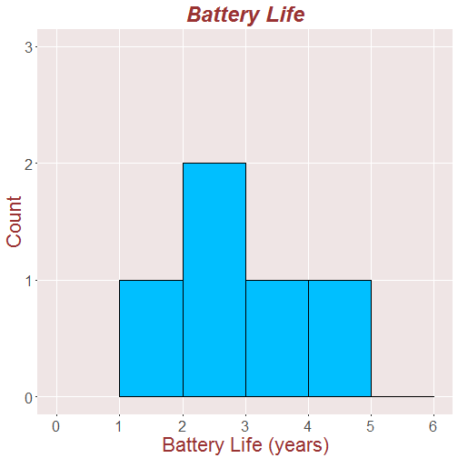
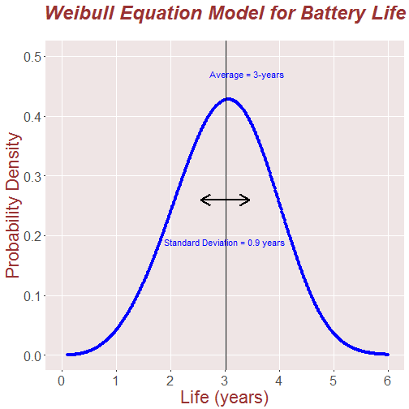
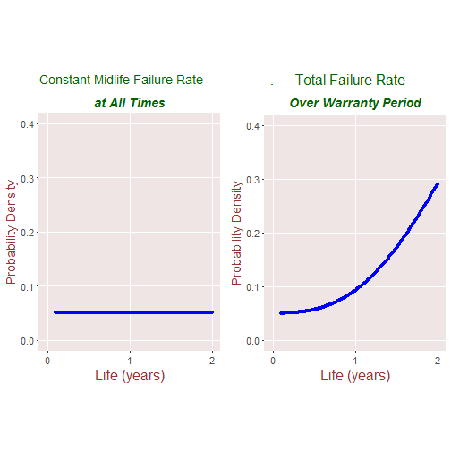
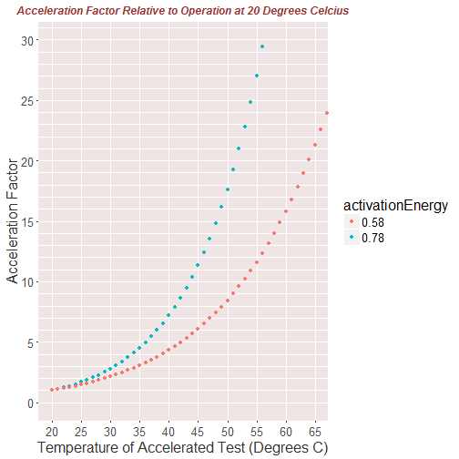

<br><br>

## Weibull Model of Product Life - Predicting Failures

#### Marcel Merchat
#### May 30, 2017


<br><br>

### Table of Contents

<br><br>

##### a) Battery Life Data 
##### b) Weibull Model for Product Life 
##### c) Arrhenius Temperature Acceleration Factor
##### d) Verification of Arrhenius Equation
##### e) Other Acceleration Models
##### f) Machine Learning
 


<br><br>

#### Using an advanced tool such as Reliasoft is a recommended way to model product failure rates. Here we describe a basic method of doing the same thing using statistics and probability. Perhaps this report offers some insight about the general problem and helps illustrate how to approach reliability in a general way. 

<br><br>

### (a) Battery Life Test Data

We use data for five car batteries from the Walpole and Myers textbook at Example-8.10. We are mostly concerned here about the method of building a Weibull Equation model. The product life data for batteries is given in years. 


```
##   Battery_ID battery_life
## 1          1          1.9
## 2          2          2.4
## 3          3          3.0
## 4          4          3.5
## 5          5          4.2
```

<br><br>



<br><br>

#### (b) Weibull Model of Product Life

The Weibull equation is a probability density function defined by the equation below where x is the time in years. The model below is similar to a normal bell-shaped distribution for Weibull parameters ${=\alpha}$ = 0.3  and $\beta = 3.72$ that were chosen so that the average and standard deviation of the distribution matches the life test data where $\bar{x} = 3$ years and variance(x) = 0.81 which is the square of the standard deviation of 0.9.

## $$ W_{pdf}  =  \alpha \cdot \beta \cdot x^{\beta-1} \cdot e^{-\alpha \cdot x^{\beta}}$$

#### The initial failure rate of the Weibull model is zero. In the following step, we add a constant failure rate that applies over the entire product life.  

<br><br>



<br><br>

## Failure Rate Probability Density


<br><br>

The things which breakdown in mid-life continue to breakdown during the entire product life. To determine the total failure rate the Weibull contribution is added to the constant failure rate. The Weibull contribution to the failure rate is initially zero until it rises to a level which affects the total near the end of an optimized  warranty period. The warranty should only last until the total failure rate has increased above the mid-life rate by a given amount.





<br><br>


#### The probability density still needs to be normalized so that the total probability or area under the cure is equal to one.

<br><br>

## (c) Arrhenius Temperature Acceleration Factor

This general equation is recommended for use by Industry standard JESD91A. But the formula was originally developed to estimate the speed of chemical reactions.

## $$AF = e^{- \frac {\phi} {K} \cdot {(\frac {1}{T_h} - \frac {1}{T_a})}}$$

Parameter | Definition
------------- | -------------
$T_h$ | Elevated temperature for test in degrees Kelvin
$T_a$ |  Typical temperature of use in degrees Kelvin
$\phi$ | Activation Energy of failing material in Joules
$K = 1.38 \cdot 10^{-23}$ | Joules per Degree Kelvin (Boltzmann Constant) 

$\phi$ is typically given in electron volts which should be multiplied by the charge of an electron or $1.6 \cdot 10^{-19}$ Coulombs to arrive at the value of $\phi$ to use in the equation. 


<br><br>

We need to know the activation energy of the failure mode mechanism to use this formula. 

<br><br>




<br><br>

## (d) Verification of Arrhenius Equation

To verify an acceleration factor, it has to be related to test data. The Arrhenius equation often applies if temperature is the main factor affecting the life cycle. For example, it applies to lead-acid batteries in storage. In the TCX paper below, the authors show that accelerated aging at 85 degrees C for 7 days is equivalent as 0.83-years at 25 Degrees C corresponding to an activation energy of about 0.578-Volts.

HTTP://www.txccorp.com/download/tech_paper/201106_2.pdf

D. Epstein, "Application and use of acceleration factors in
microelectronics testing", Solid State Technology, 116, 1982 

http://web.utk.edu/~leon/rel/Fall04pdfs/567Unit19.pdf

<br><br>

## (e) Other Acceleration Models

#### Temperature and Humidity - Eyring
#### Coffin-Manson mechanical crack growth
#### Arrhenius Temperature Acceleration
#### The (inverse) power rule for voltage
#### The exponential voltage model
#### Electromigration model (DC Voltages)
#### Heat Cycle - Coffin-Manson

<br><br>

## (f) Machine Learning

A related approach that is starting to be used to estimate warranty costs is machine learning. We need to fill up a spreadsheet or database with engineering and cost data for other products. Data columns can contain discrete as well as continuous data, even things like the type of engine, the number of cylinders, and the horsepower. The warranty costs for the new product are then predicted based on the data for the other products using algorithms available in R and Python and perhaps other suitable tools. But models are only as good as the data; all known engineering reliability parameters, warranty cost data, and even weather data should be included to make the best predictions.

Weibull model data should be included in the machine learning model too.     

### Reproducible Report

This report is produced by a R Markdown program that contains the text and "code blocks" that execute the math formulas and generate the plots when the webpage is generated. This is what makes the report reproducible. The file type is called "Markdown" because it is simple and requires no knowledge of html ("Markup") to use. The program begins by downloading the raw data automatically from a website or server so that the entire process is reproducible. The code blocks and output are hidden or displayed in order to keep the report understandable but the entire program including all code blocks appears in the Github repository such as the one at the bottom of this report. 

<br><br>

#### THE END
